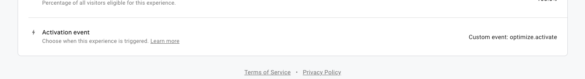

### The problem

It's common that client-side A/B testing solutions often cause a **flash of original content (FOOC)** before the alternative experiment variant appears.
At best it's a visual annoyance, at worst it taints your testing data and renders your experiment useless.

This occurs because the page loads with its structure and styling before the A/B testing script is able to run and modify the DOM. Sometimes this happens so quickly you hardly notice it, but other times there is a very noticeable switch that occurs.

The FOOC is so common, in fact, that Google Optimize offers an anti-flicker snippet aimed at preventing it. However, if you're like us and are using the popular `gatsby-plugin-google-tagmanager` to deliver your marketing scripts (including Optimize),
this snippet isn't included (and Google warns against including it in GTM anyways), so you'll need to add it yourself. Adding it isn't very straightforward, especially because you have to ensure the loading order of the snippet relative to your GTM script and your `dataLayer` initialization.

This is how I did it, so hopefully it's helpful if you're hitting a roadblock.

### The solution

[Per Google's documentation](https://support.google.com/optimize/answer/7100284?hl=en), the anti-flicker snippet must be initialized _below_ the `window.dataLayer` initialization and _above_ the GTM container initialization, so we need a way to manipulate the order of our head components during build time. [Gatsby has a server rendering api](https://www.gatsbyjs.com/docs/ssr-apis/) specifically for this called `onPreRenderHTML`.

The code below creates a script tag for the dataLayer initialization, a style tag for the anti-flicker styles, and another script tag for the anti-flicker script.

The scripts are gathered into an array and spread into a new array _before_ your site's existing head components, which you can grab by using the parameter `getHeadComponents`. Finally, you'll replace the head components by calling `replaceHeadComponents` with this new array of merged head components.

**Note:** don't forget to add your GTM container ID on line 16.

```js
import React from 'react';

const createDataLayer = () => ({
	__html: 'window.dataLayer = window.dataLayer || []'
});

const optimizeAntiFlickerStyle = () => ({
	__html: '.async-hide { opacity: 0 !important}'
});

const optimizeAntiFlickerScript = (containerId) => ({
	__html: `(function(a,s,y,n,c,h,i,d,e){s.className+=' '+y;h.start=1*new Date;
h.end=i=function(){s.className=s.className.replace(RegExp(' ?'+y),'')};
(a[n]=a[n]||[]).hide=h;setTimeout(function(){i();h.end=null},c);h.timeout=c;
})(window,document.documentElement,'async-hide','dataLayer',4000,
{'<GTM CONTAINER ID>':true});`
});

const customHeadComponents = [
	<script dangerouslySetInnerHTML={createDataLayer()} />,
	<style dangerouslySetInnerHTML={optimizeAntiFlickerStyle()} />,
	<script dangerouslySetInnerHTML={optimizeAntiFlickerScript(containerId)} />
];

export const onPreRenderHTML = ({ getHeadComponents, replaceHeadComponents }) => {
	const mergedHeadComponents = [...customHeadComponents, ...getHeadComponents()];

	replaceHeadComponents(mergedHeadComponents);
};
```

#### Possible gotcha

The components fetched by `getHeadComponenets` in `onPreRenderHTML` are only the head components that exist in that particular moment of the build. That means if there are plugins that also use this API, they could alter the order of the head components again. In can't find a definitive order of execution in [Gatsby's documentation](https://www.gatsbyjs.com/docs/gatsby-lifecycle-apis/) with regard to the plugins vs root `gatsby-ssr` files, so I'm actually not sure if using the above code in your root `gatsby-ssr` file is an issue. To be safe, I created a custom plugin and added it at the bottom of `gatsby-config` to ensure it runs last.

### Creating a plugin

To do that, add the following to your `plugins` directory (or create one if it doesn't exist).

```
plugins/
  gatsby-plugin-anti-flicker/
    gatsby-ssr.js
    package.json
public/
src/
```

Copy and paste the above anti-flicker code into your new `gatsby-ssr` file inside the plugin directory.

So we can reference the plugin by name in our root `gatsby-config` file, in the plugin's `package.json` add:

```json
{
	"name": "gatsby-plugin-anti-flicker",
	"dependencies": {
		"react": "^16.13.1"
	}
}
```

`cd` into the plugin directory and install React with `npm install`. You need React to use `dangerouslySetInnerHTML`.

Now, open your root `gatsby-config` file and at the bottom of your plugins add `gatsby-plugin-anti-flicker`.

```js
// ...
  plugins: [
    'plugin-a', // obvi fake plugins
    'plugin-b',
    {
      resolve: 'plugin-c',
      options: {
        id: 123
      }
    },
    'gatsby-plugin-anti-flicker',
  ],
}
```

Restart your dev server or rebuild your site and you should see the three tags together in the `<head>` above the script that initializes your GTM container.

If you run into issues or I missed something, let me know on [Twitter](https://twitter.com/abohannon).

### Final thought: Activating Optimize on route change

You may have already handled this, but don't forget to update your "Activation event" in Optimize and push `{ event: 'optimize.activate' }` into your dataLayer on route change to ensure your experiments persist as your visitors navigate your site. Otherwise the experiments will only appear when the experiment page(s) are deep linked/visited directly. If a visitor navigates away and comes back, the experiment variation will disappear.



```js
// Activates Google Optimize experiments
const activateOptimize = () => {
	window.dataLayer = window.dataLayer || [];
	window.dataLayer.push({ event: 'optimize.activate' });
};

export const onRouteUpdate = () => {
	// ...

	activateOptimize();
};
```
